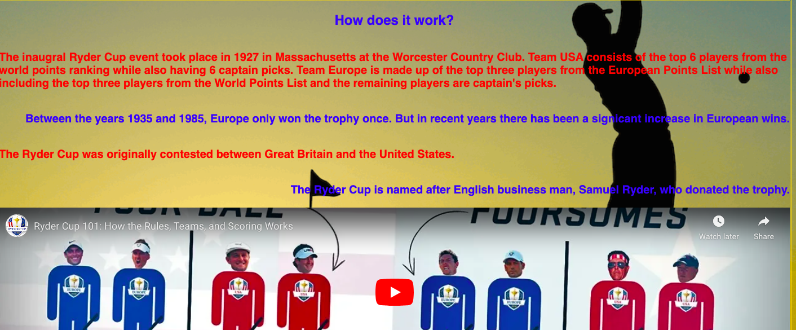

# Welcome to my project on the History of the Ryder Cup

The reason I chose this project is because I really wanted to showcase the history of the Ryder Cup and all of its glory. The Ryder Cup being in County Limerick, Ireland in 2027 also influenced my decision as it's pretty topcial in the golf world right now. So why not have a look at some history of the event and even register for some tickets?

The project is aimed mainly at golfers.

# Deployed site

The project can be viewed [here](https://drennan98.github.io/History-of-the-Ryder-Cup/).

# Features

At the top left of the page, we have the heading of the website which clearly shows what the website is about, this is a clickable heading which will bring the user back to the home page.

The website contains 3 pages **Home, Gallery and Tickets** and these are displayed in the top right.

- Header

- Body of page

I've added in some facts about the Ryder Cup and a short video to how the actual competition works.

- Footer

Contains social media links which conveniently link to all Ryder Cup social media platforms.

