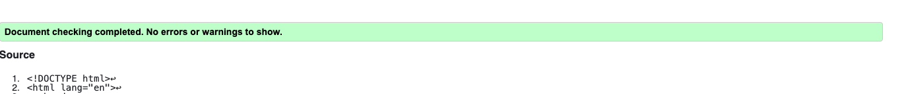
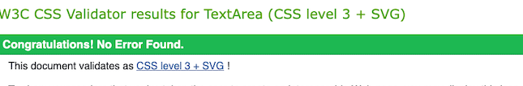

# Welcome to my project on the History of the Ryder Cup

The reason I chose this project is because I really wanted to showcase the history of the Ryder Cup and all of its glory. The Ryder Cup being in County Limerick, Ireland in 2027 also influenced my decision as it's pretty topcial in the golf world right now. So why not have a look at some history of the event and even register for some tickets?

The project is aimed mainly at golfers.

# Deployed site

The project can be viewed [here](https://drennan98.github.io/History-of-the-Ryder-Cup/).

# Features

At the top left of the page, we have the heading of the website which clearly shows what the website is about, this is a clickable heading which will bring the user back to the home page.

The website contains 3 pages **Home, Gallery and Tickets** and these are displayed in the top right.

## Home

- Header

Contains the heading and the navigation links for Home, Gallery and Ticket. The font is clear and readable. I fixed the header so users can easily access the all parts of the website while scrolling.

- Body of page

I've added in some facts about the Ryder Cup and a short video to how the actual competition works. The red and blue colors are used to represent the colors of each teams flags. Blue representing Europe while red represents America.

- Footer

Contains social media links which conveniently link to all Ryder Cup social media platforms.

## Gallery

- Contains images of iconic Ryder Cup moments. I picked 5 images which I thought best suited the project.
  I aligned the photos vertically and curved the corners to make it more visually appealing.

## Tickets

- Contains a sign up form for golfers to register their interest in tickets for future Ryder Cups. The form contains fields like Full Name, Email Address, Password and Confirm Password.

##  Testing

- I confirmed that this website works on different browsers like Safari and Google Chrome.

- I confirmed that the navigation, header and social media links all work as intended.

- The social media icons link to the actual Ryder Cup accounts which I thought added more authenticity.

- I confirmed tha the form cannot be filled out unless every field is filled.

## Bugs

- When adding the video, I used the "video" element which wasnt't supported. I contacted a tutor who advised me to use the "iframe" element which fixed the issue.

- Some images were stretched and pixelated at first. So I deleted them and added new ones which rendered perfectly.

# Validator testing

- HTML

No errors appeared when I put the code through the official HTML validator

- CSS

No errors appeared when I put the code through the official CSS validator.

- Accessibility

# Deployment

- The site was deployed to GitHub pages. **The steps I took to achieve this were:**

- Go to the settings in the GitHub repository.

- Navigate your way to the pages section which should be the last tab on the left under Code and Automation.

- Make sure the source is Deploy from a branch.

- Set the branch to "main" and click save.

- The project can be viewed [here](https://drennan98.github.io/History-of-the-Ryder-Cup/).

# Credits

- My mentor, Spencer for his patience with me and taking time out of his day for the mentor sessions.

- Gavin Soady, of Enfer Medical.

- The Ryder Cup website which I used to gather ideas.

- ChatGPT, which I found very useful for getting a second reading about something I was not sure about. Spencer introduced me to it.
- Stack Overflow.
